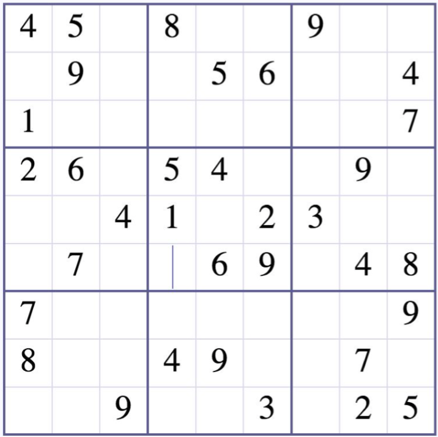

# Sudoku
<p align="center">
   
</p>

## Welcome
This program solves the Sudoku project by calculating the set of possible values, then as each cell is solved, updates the list of possibilities using NumPy and python's set() method. No recursion is used. This program is written in Python3. The code will solve Easy-rated puzzles. My blog on how I created this program is at https://medium.com/@feliciaSWE/solving-sudoku-with-python-numpy-and-set-95ca55f9ba01

## Table of Contents
* [Requirements](#requirements)
* [Installation](#installation)
* [Usage](#usage)

## Requirements
* Python 3.4.3
* numpy (python3 library)
* json (python3 library)
* pprint (python3 library)
* Ubuntu 14.04 LTS

## Installation
In your terminal, git clone the directory with the following command:
```
git clone https://github.com/feliciahsieh/practice
cd sudoku
```

## Usage
To solve the sudoku puzzles stored in sudoku.json, at your shell prompt, type:

```sh
./sudoku.py
```

You may store as many sudoku files as you want solved. The current sudoku.json file has two unsolved puzzles.
```
{
  "puzzle":[
    [
      [4, 5, 0, 8, 0, 0, 9, 0, 0],
      [0, 9, 0, 0, 5, 6, 0, 0, 4],
      [1, 0, 0, 0, 0, 0, 0, 0, 7],
      [2, 6, 0, 5, 4, 0, 0, 9, 0],
      [0, 0, 4, 1, 0, 2, 3, 0, 0],
      [0, 7, 0, 0, 6, 9, 0, 4, 8],
      [7, 0, 0, 0, 0, 0, 0, 0, 9],
      [8, 0, 0, 4, 9, 0, 0, 7, 0],
      [0, 0, 9, 0, 0, 3, 0, 2, 5]
    ],
    [
      [3, 6, 0, 2, 0, 5, 0, 0, 0],
      [0, 1, 5, 4, 0, 3, 0, 8, 0],
      [0, 0, 4, 9, 1, 0, 0, 0, 0],
      [4, 5, 7, 0, 0, 0, 0, 9, 1],
      [0, 0, 2, 0, 0, 0, 3, 0, 0],
      [8, 3, 0, 0, 0, 0, 7, 6, 4],
      [0, 0, 0, 0, 9, 4, 8, 0, 0],
      [0, 2, 0, 3, 0, 6, 1, 4, 0],
      [0, 0, 0, 8, 0, 2, 0, 7, 9]
    ]
  ]
}
```
