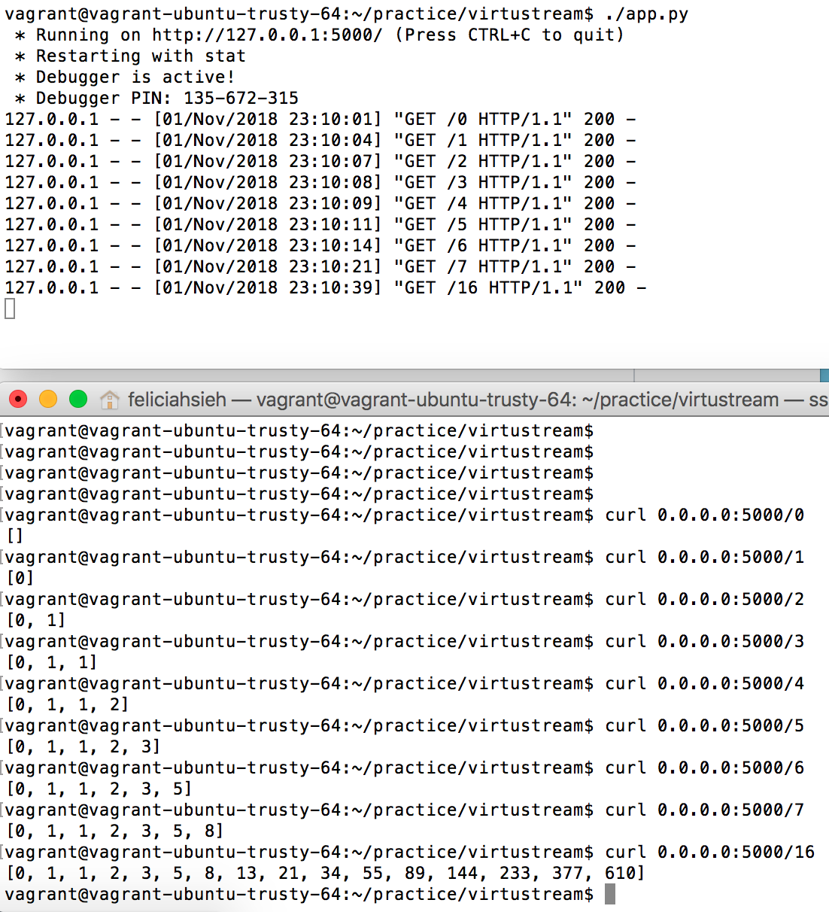

# Virtustream Fibonacci app

<p align="center"></p>

## Welcome
REST app that sends the requested elements of the Fibonacci sequence.

First series of Fibonacci starts with 0, 1, 1, 2, 3, ...

Test files are in the ```tests``` directory.

This app uses python, flask. Curl is used for testing.


## Table of Contents
* [Environment](#environment)
* [Requirements](#requirements)
* [Installation](#installation)
* [Usage](#usage)


## Environment
* Ubuntu 14.04 LTS
* Vagrant 2.0.2
* SSH (for logging into vagrant)
* curl 7.35.0


## Requirements
* Python 3.4.2 - Python is installed in /usr/bin/python3. You may have to adjust the directory path to your python source files accordingly in each of the *.py files.
* Flask 0.12.2


## Installation
In your terminal window, git clone the directory with the following command:

```
git clone https://github.com/feliciahsieh/practice/virtustream/fibonacci.git
```

To install setuptools for python 3.x:
```
sudo apt-get install python3-setuptools
```


## Usage
In one vagrant window, run (and leave it running):
```
./app.py
```

In second vagrant window, run the curl command using port 5000.
```
curl 0.0.0.0:5000/<n>    <- where <n> is the Fibonacci sequence you want
```

Here's the screenshot of both vagrant windows after running a number of queries, where,
n = 0
n = 1
n = 2
n = 3
n = 4
n = 5
n = 6
n = 7
n = 16

<p align="center"></p>
